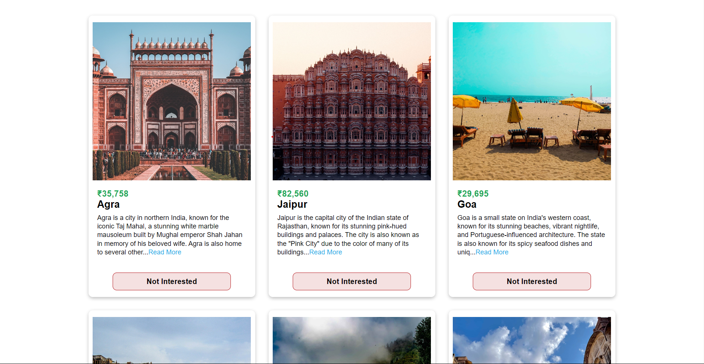

# Tour Plan Website

The Tour Plan Website is a React-based web application built with Tailwind CSS. This project provided an opportunity to explore advanced React concepts and sharpen styling skills. The website serves as a platform for users to discover tourist destinations, learn about them, and decide whether they are interested in visiting these places.




## Table of Contents

- [Overview](#overview)
- [Installation](#installation)
- [Usage](#usage)
- [Features](#features)
- [Technologies Used](#technologies-used)
- [Contributing](#contributing)
- [License](#license)

## Overview

The Tour Plan Website offers users a unique way to explore tourist destinations. Key features include:

- **Tourist Destinations:** The website presents a list of tourist places, complete with names and descriptions.

- **Interest Toggle:** Users can click the "I'm not interested" button to remove a tourist destination from their view. This allows them to explore more options and customize their travel plans.

- **Refresh Option:** If a user has discarded all available tourist destinations, the website displays a message indicating "No more tours left" and provides a button to refresh and see all the cities again.

The project enhances the user's experience by providing a dynamic and interactive platform for planning their tours.

## Installation

1. Clone the repository:

   ```bash
   git clone https://github.com/sargunkohli152/Tour-Plan.git

2. Install dependencies

   ```bash
   npm install

3. Start the application

   ```bash
   npm run start

## Usage
 - Browse the list of tourist destinations, each with its name and description.
 - Click the "I'm not interested" button to remove a tourist destination you are not interested in.
 - If all tourist destinations have been discarded, use the refresh button to see all the cities again.


## Features
 - Interactive and dynamic tourist destination display.
 - Customization of travel plans through the "I'm not interested" button.
 - User-friendly refresh option to explore all cities again.


## Technologies Used
 - React.js
 - Tailwind CSS

## Contributing
Contributions are welcome! If you have any suggestions, improvements, or want to add new features to enhance the Tour Plan Website, please fork the project, make your changes, and submit a pull request.

## License
MIT License

Permission is hereby granted, free of charge, to any person obtaining a copy of this software and associated documentation files (the "Software"), to deal in the Software without restriction, including without limitation the rights to use, copy, modify, merge, publish, distribute, sublicense, and/or sell copies of the Software, and to permit persons to whom the Software is furnished to do so, subject to the following conditions:

The above copyright notice and this permission notice shall be included in all copies or substantial portions of the Software.

THE SOFTWARE IS PROVIDED "AS IS", WITHOUT WARRANTY OF ANY KIND, EXPRESS OR IMPLIED, INCLUDING BUT NOT LIMITED TO THE WARRANTIES OF MERCHANTABILITY, FITNESS FOR A PARTICULAR PURPOSE AND NONINFRINGEMENT. IN NO EVENT SHALL THE AUTHORS OR COPYRIGHT HOLDERS BE LIABLE FOR ANY CLAIM, DAMAGES OR OTHER LIABILITY, WHETHER IN AN ACTION OF CONTRACT, TORT OR OTHERWISE, ARISING FROM, OUT OF OR IN CONNECTION WITH THE SOFTWARE OR THE USE OR OTHER DEALINGS IN THE SOFTWARE.
